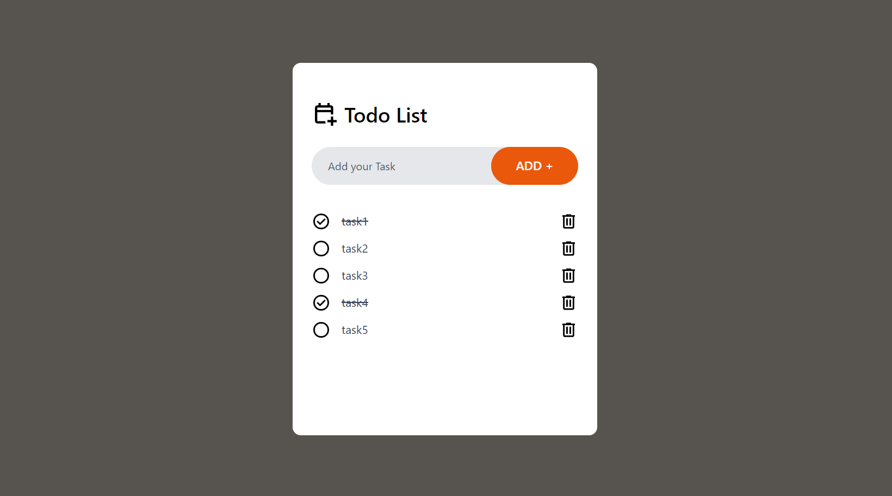
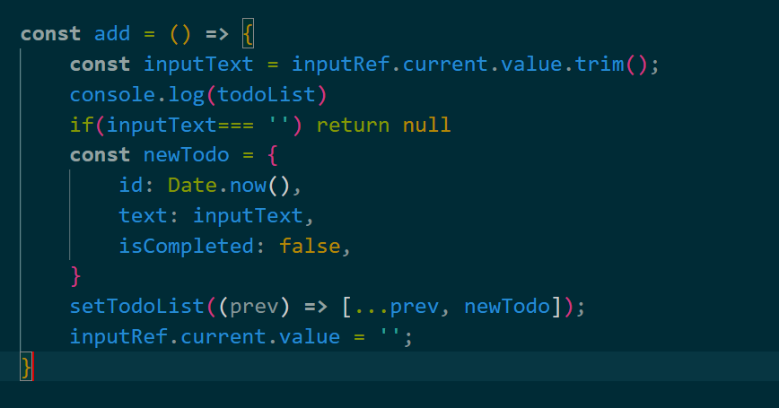
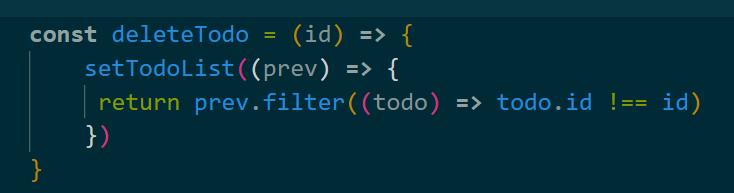
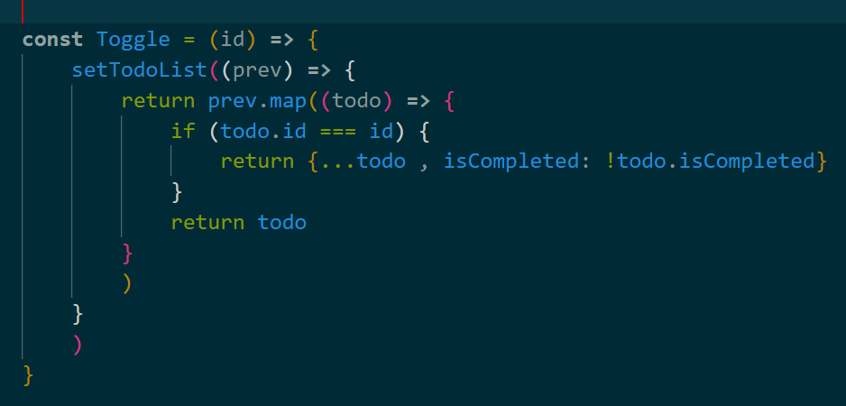

This is a simple React TodoApp
Styling of this project is provided by Tailwind utility classes and a simple ui which is userfriendly.

The main functionality of this todo app is given by using ReactHooks.
The main hooks that are used in this project are the following
 -useEffect
 -useState
 -useRef

We are not discussing about the styling part in this documentation

To take the input data from the input field we use useRef which refers to the input tag and stores the entered value in the state variables

the data is an array which contains a data of the input task 
{
    text,
    isCompleted,
    id
}
 which is empty at start and the data is filled while the tasks are getting filled.

we are needed three functions to add the input data into the task list 
another function is delete task function
and the last function is Toggle function which is used to delete the input and also specifies the state of the task.

Add function.
    
    <!-- const add = () => {
        const inputText = inputRef.current.value.trim();
        console.log(todoList)
        if(inputText=== '') return null
        const newTodo = {
            id: Date.now(),
            text: inputText,
            isCompleted: false,
        }
        setTodoList((prev) => [...prev, newTodo]);
        inputRef.current.value = '';
    } -->

this function updates the data or the task that has entered in the input field by using state variables.and also updates to the input field into empty state after the function is fully executed.
the trim function in the add function trims the empty spaces in the input field.
if the input field is empty the if condition triggers and returns null.

A newTodo object is created and passed to the function.

<!-- 
 const deleteTodo = (id) => { 
        setTodoList((prev) => {
         return prev.filter((todo) => todo.id !== id)
        })
    } -->

The delete function takes an id from the newTodo object
this function filters the id of the given id from the object.

    
    <!-- const Toggle = (id) => {
        setTodoList((prev) => {
            return prev.map((todo) => {
                if (todo.id === id) {
                    return {...todo , isCompleted: !todo.isCompleted}
                }
                return todo
            }
            )
        }
        )
    } -->

